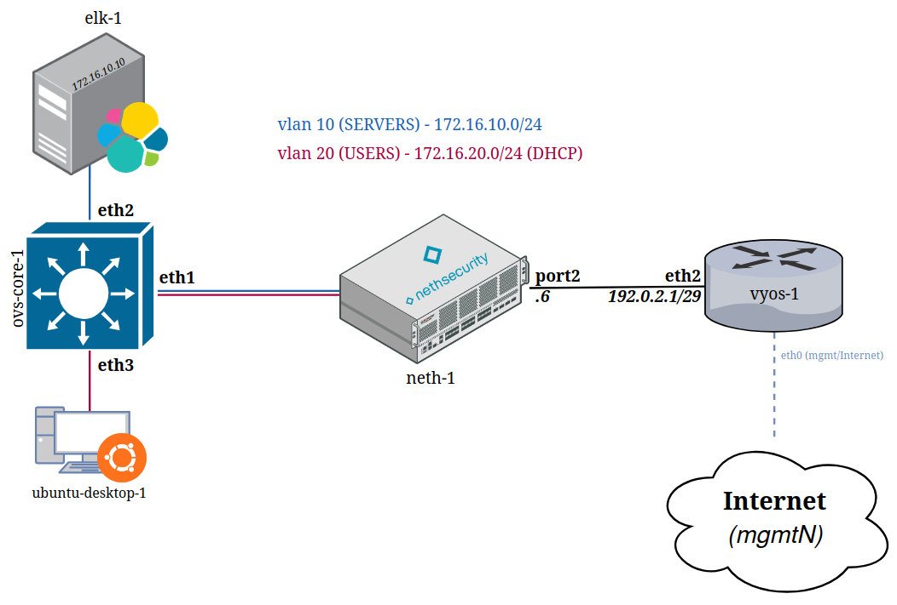
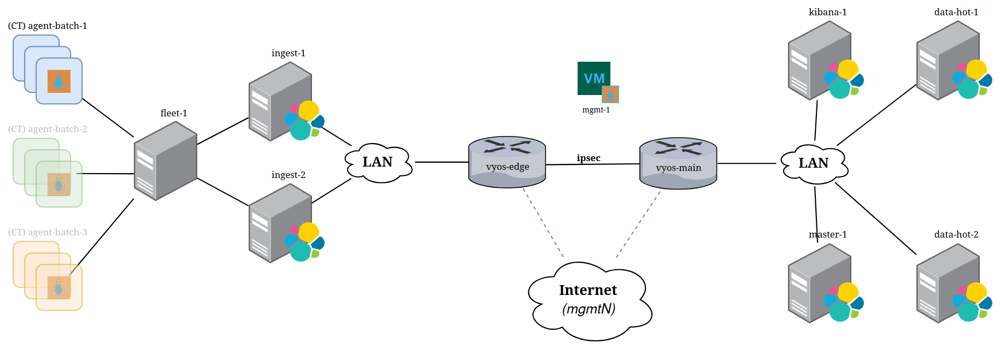
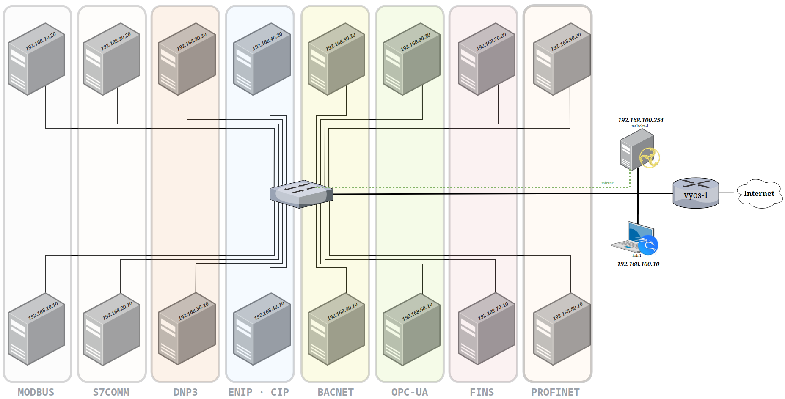

# proxmox-lab-platform

A multi-user lab automation platform for Proxmox VE. Define network topologies and VM/CT workloads in a single YAML scenario file; the platform provisions everything — VMs, LXC containers, SDN VNets, DHCP reservations, and Ansible configuration — and tears it all down cleanly when you're done.

Designed for security labs, Elasticsearch benchmark demos, and OT/ICS protocol simulation.

Successor to [lab-platform](https://github.com/celeroon/lab-platform), a libvirt-based predecessor with a similar scenario-driven model.

---

## Requirements

- Proxmox VE 8.1+ (tested on 9.x) — single node or cluster
- Management VM: Debian 12 or 13, static IP, SSH accessible
- Proxmox API token for `root@pam` (privilege separation disabled)
- SDN `labmgmt` zone with the built-in `pve` IPAM plugin

---

## Setup

```bash
cp .env.example .env   # fill in PROXMOX_HOST, PROXMOX_TOKEN_ID, PROXMOX_TOKEN_SECRET, MGMT_VMID
./setup.sh
```

`setup.sh` is idempotent — safe to re-run. It installs dependencies, configures PostgreSQL, sets up NFS template storage, registers Proxmox SDN zones, and starts the `lab-platform` FastAPI service.

---

## Quick start

### Users

```bash
lab user create <user>                           # password auto-generated, printed once
lab user create <user> --password s3cret            # set a specific password
lab user list

# Reset a user's password
lab user reset-password <user>                       # auto-generate a new one (printed once)
lab user reset-password <user> --password newpass    # or set it explicitly
```

### Templates

VM templates are downloaded from Vagrant Cloud and imported into Proxmox:

```bash
lab template fetch generic-x64/debian12
lab template fetch vyos/current
lab template fetch joaobrlt/ubuntu-desktop-24.04
lab template fetch kalilinux/rolling
lab template list
```

LXC container templates:

```bash
lab template ct fetch debian-13-standard_13.1-2_amd64
lab template ct list
```

Custom appliance templates (built via Packer):

```bash
# NethSecurity: auto-downloads the image and builds a Proxmox template
lab template build nethsecurity 8.7.2

# Custom download URL (e.g. a mirror or a pre-release build)
lab template build nethsecurity 8.7.2 --url https://updates.nethsecurity.nethserver.org/stable/8.7.2/targets/x86/64/nethsecurity-8.7.2-x86-64-generic-squashfs-combined-efi.img.gz
```

---

## Scenarios

Deployment lifecycle commands work the same for every scenario.

```bash
lab deploy status                                      # list all deployments
lab deploy show <deployment-name> --user <user>        # VMs, IPs, status
lab ssh <vm-name> --user <user>                        # SSH into a VM by name
lab ssh <vm-name> --user <user> --deployment <name>   # disambiguate if VM name exists in multiple deployments
lab console <deployment-name> --user <user>            # noVNC console URLs for all running VMs
lab deploy stop <deployment-name> --user <user>        # stop VMs, keep deployment
lab deploy resume <deployment-name> --user <user>      # start stopped VMs
lab deploy destroy <deployment-name> --user <user>     # destroy VMs and clean up
```

---

### net-basic-lin

Single VyOS router with a minimal Ubuntu host. Used to verify network provisioning and basic Ansible connectivity.

[scenario.yml](scenarios/net-basic-lin/scenario.yml)

```bash
lab deploy start net-basic-lin --user <user>
lab ssh vyos-1 --user <user>
lab deploy destroy net-basic-lin --user <user>
```

#### Topology diagram




---

### net-elastic-cluster

3-node Elasticsearch cluster with dedicated Kibana, Fleet Server, and an Ubuntu agent VM behind a VyOS router. Good starting point for Elastic Stack labs.

[scenario.yml](scenarios/net-elastic-cluster/scenario.yml)

```bash
lab deploy start net-elastic-cluster --user <user>
```

---

### elastic-benchmark-ct-sn

Single-node Elasticsearch + Kibana + Fleet. Agent workload runs as LXC containers (higher density than VMs). Deploy the ELK node first, then add agent batches one at a time to observe load growth.

[scenario.yml](scenarios/elastic-benchmark-ct-sn/scenario.yml)

```bash
lab deploy start elastic-benchmark-ct-sn --user <user> --target mgmt-1,elk-1
lab deploy start elastic-benchmark-ct-sn --user <user> --target agent-batch-1
lab deploy start elastic-benchmark-ct-sn --user <user> --target agent-batch-2
```

---

### elastic-benchmark-ct-cluster

Role-separated Elasticsearch cluster intentionally constrained to one data node so saturation hits at ~100–150 agents. Demonstrates live capacity scaling: load the cluster until it degrades, then add `data-2`, `coord-1`, `data-warm-1`, `data-cold-1` to the same running deployment and measure latency recovery with esrally.

[scenario.yml](scenarios/elastic-benchmark-ct-cluster/scenario.yml)

```bash
# Step A — create scale-out VMs first so their IPs exist for cert pre-generation
lab deploy start elastic-benchmark-ct-cluster --user <user> \
  --target data-2,coord-1,data-warm-1,data-cold-1 --skip-ansible

# Step B — provision the core cluster
lab deploy start elastic-benchmark-ct-cluster --user <user> \
  --target master-1,data-1,ingest-1,kibana-1,fleet-1,mgmt-1

# Load phases — add agent batches until the cluster degrades
lab deploy start elastic-benchmark-ct-cluster --user <user> --target agent-batch-1
lab deploy start elastic-benchmark-ct-cluster --user <user> --target agent-batch-2

# Scale-out — add capacity to the running cluster and observe recovery
lab deploy start elastic-benchmark-ct-cluster --user <user> --target data-2
lab deploy start elastic-benchmark-ct-cluster --user <user> --target coord-1
lab deploy start elastic-benchmark-ct-cluster --user <user> --target data-warm-1,data-cold-1
```

---

### elastic-benchmark-ct-cluster-3node

Larger sibling of `elastic-benchmark-ct-cluster`, sized for a 3-node Proxmox/Ceph cluster (~692 GB RAM). Multi-master quorum, multiple ingest nodes, coordinating nodes, and ILM warm/cold tiers. Same staged saturation-then-scale-out demo at roughly 2× the agent count.

[scenario.yml](scenarios/elastic-benchmark-ct-cluster-3node/scenario.yml)

```bash
# Step A — create scale-out VMs first
lab deploy start elastic-benchmark-ct-cluster-3node --user <user> \
  --target data-2,data-3,data-4,coord-1,coord-2,data-warm-1,data-cold-1 --skip-ansible

# Step B — provision the core cluster
lab deploy start elastic-benchmark-ct-cluster-3node --user <user> \
  --target master-1,master-2,master-3,data-1,ingest-1,ingest-2,kibana-1,fleet-1,mgmt-1

# Load and scale-out — same pattern as elastic-benchmark-ct-cluster
```

---

### elastic-benchmark-ipsec

Multi-site Elasticsearch lab with site-to-site IKEv2 IPsec VPN (AES-256-GCM). Edge site (172.16.0.0/16): VyOS + Fleet + ingest + agent CTs. Main site (172.17.0.0/16): VyOS + ES cluster + Kibana. ES inter-node transport crosses the IPsec tunnel.

[scenario.yml](scenarios/elastic-benchmark-ipsec/scenario.yml)

```bash
# Step A — create scale-out VMs first
lab deploy start elastic-benchmark-ipsec --user <user> \
  --target data-hot-2,data-hot-3,data-cold-1,coord-1,ingest-2 --skip-ansible

# Step B — provision the full two-site topology
lab deploy start elastic-benchmark-ipsec --user <user> \
  --target vyos-edge,vyos-main,mgmt-1,master-1,data-hot-1,ingest-1,kibana-1,fleet-1

# Step C — add agents and scale out
lab deploy start elastic-benchmark-ipsec --user <user> --target agent-batch-1
lab deploy start elastic-benchmark-ipsec --user <user> --target data-hot-2,data-hot-3,ingest-2
```

#### Topology diagram



---

### ot-lab

OT/ICS protocol simulation lab. Eight protocol pairs (Modbus, S7comm, DNP3, OPC-UA, BACnet, EtherNet/IP-CIP, FINS, PROFINET) each on a dedicated VLAN, mirrored through an OVS switch to Malcolm for ICS-aware network traffic analysis. Includes ACID-based ATT&CK for ICS detection and OpenSearch alerting monitors per protocol.

[scenario.yml](scenarios/ot-lab/scenario.yml)

```bash
lab deploy start ot-lab --user <user>
```

#### Topology diagram



#### Running the ICS attack scripts

Each protocol has an attack script pre-deployed on `kali-1` under `/opt/ot-attacks/`, in a self-contained Python venv. SSH into kali-1 and activate the venv:

```bash
lab ssh kali-1 --user <user>
source /opt/ot-attacks/venv/bin/activate
```

Then run any protocol's attack against its OT server (targets are fixed by the scenario's VLAN addressing):

```bash
python3 /opt/ot-attacks/modbus_attack.py   --target 192.168.10.10                          # Modbus          :502
python3 /opt/ot-attacks/s7comm_attack.py   --target 192.168.20.10                          # S7comm          :102
python3 /opt/ot-attacks/dnp3_attack.py     --target 192.168.30.10                          # DNP3            :20000
python3 /opt/ot-attacks/opcua_attack.py    --target 192.168.60.10                          # OPC-UA          :4840
python3 /opt/ot-attacks/bacnet_attack.py   --target 192.168.50.10 --bind-ip 192.168.100.10 # BACnet (UDP)    :47808
python3 /opt/ot-attacks/enip_attack.py     --target 192.168.40.10                          # EtherNet/IP-CIP :44818
python3 /opt/ot-attacks/fins_attack.py     --target 192.168.70.10                          # FINS            :9600
python3 /opt/ot-attacks/profinet_attack.py --target 192.168.80.10                          # PROFINET (UDP)  :34964
```

`modbus_attack.py` also accepts `--continuous` to repeat every 30s. The full runbook — what each script triggers and where it shows up in Malcolm — is in `/opt/ot-attacks/ATTACK_INSTRUCTIONS.txt` on kali-1 (also on its Desktop).

---

## Disclaimer

This project is for **educational and research use in a closed, virtual lab environment only**. Do **not** use any techniques, tools, or configurations from this repository against real systems, production networks, or assets you do not own or lack explicit written permission to test. Always comply with all applicable laws, regulations, licenses, and organizational policies.

The authors and contributors assume **no responsibility or liability** for any misuse, damage, loss of data, service disruption, or legal consequences arising from the use of this material. **No warranty** is provided — use at your own risk.
