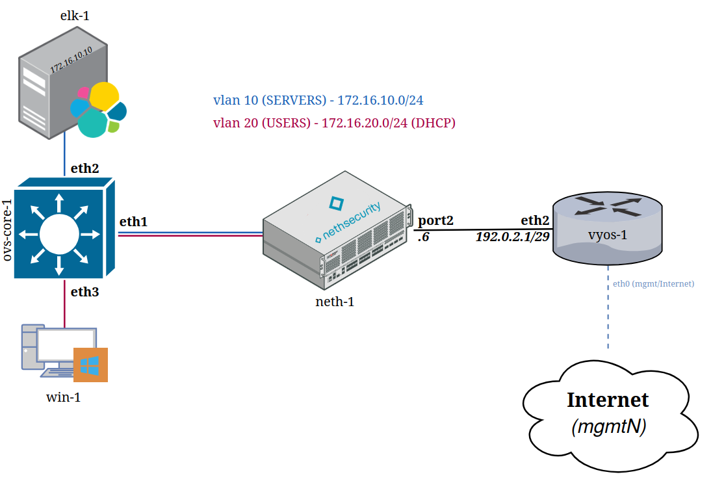

# proxmox-lab-platform

A multi-user lab automation platform for Proxmox VE. Define network topologies and VM/CT workloads in a single YAML scenario file; the platform provisions everything — VMs, LXC containers, SDN VNets, DHCP reservations, and Ansible configuration — and tears it all down cleanly when you're done.

Designed for security labs, Elasticsearch benchmark demos, and OT/ICS protocol simulation.

Successor to [lab-platform](https://github.com/celeroon/lab-platform), a libvirt-based predecessor with a similar scenario-driven model.

---

## Requirements

- Proxmox VE 8.1+ (tested on 9.x) — single node or cluster
- Management VM: Debian 12 or 13, static IP, SSH accessible
- Proxmox API token for `root@pam` (privilege separation disabled)
- SDN `labmgmt` zone with the built-in `pve` IPAM plugin

---

## Setup

```bash
cp .env.example .env   # fill in PROXMOX_HOST, PROXMOX_TOKEN_ID, PROXMOX_TOKEN_SECRET, MGMT_VMID
./setup.sh
```

`setup.sh` is idempotent — safe to re-run. It installs dependencies, configures PostgreSQL, sets up NFS template storage, registers Proxmox SDN zones, and starts the `lab-platform` FastAPI service.

---

## Quick start

### Users

```bash
lab user create <user>                           # password auto-generated, printed once
lab user create <user> --password s3cret            # set a specific password
lab user list

# Reset a user's password
lab user reset-password <user>                       # auto-generate a new one (printed once)
lab user reset-password <user> --password newpass    # or set it explicitly
```

### Templates

VM templates are downloaded from Vagrant Cloud and imported into Proxmox:

```bash
lab template fetch generic-x64/debian12
lab template fetch vyos/current
lab template fetch joaobrlt/ubuntu-desktop-24.04
lab template fetch kalilinux/rolling
lab template fetch gusztavvargadr/windows-11-22h2-enterprise
lab template list
```

LXC container templates:

```bash
lab template ct fetch debian-13-standard_13.1-2_amd64
lab template ct list
```

Custom appliance templates (built via Packer):

```bash
# NethSecurity: auto-downloads the image and builds a Proxmox template
lab template build nethsecurity 8.7.2

# Custom download URL (e.g. a mirror or a pre-release build)
lab template build nethsecurity 8.7.2 --url https://updates.nethsecurity.nethserver.org/stable/8.7.2/targets/x86/64/nethsecurity-8.7.2-x86-64-generic-squashfs-combined-efi.img.gz
```

#### Windows

Builds a Windows template **directly on a Proxmox node** with [rgl/windows-vagrant](https://github.com/rgl/windows-vagrant) via Packer's `proxmox-iso` builder — an alternative to fetching a prebuilt box from Vagrant Cloud.

```bash
lab template build windows 11      # Windows 11 24H2 (UEFI)     → template: windows-11
lab template build windows 2025    # Windows Server 2025 (UEFI) → template: windows-2025

# flags (Windows only):
lab template build windows 11 --dry-run         # preview detected node/storage/bridge/VLAN + config, build nothing
lab template build windows 11 --skip-update     # skip Windows Update during the build (default: it runs)
lab template build windows 11 --skip-optimize   # skip the SDelete free-space zero-fill (default: it runs)
```

The build runs on the Proxmox node's real hardware — **no nesting on the management VM**, so nested virtualization is not required. It auto-detects the node, disk storage (Ceph → ZFS → LVM-thin), an ISO-capable store, and the management VM's bridge/VLAN, then creates the template in the platform's 9000–9999 range as `windows-<variant>`. Point a scenario's `template:` at it (e.g. `windows-11`); the `11`/`2025` variants are UEFI, matching the `bios: ovmf` / `q35` settings the `net-basic-win` scenario expects.

- **Windows Update runs by default** (`--skip-update` to skip); the SDelete free-space compaction also runs by default (`--skip-optimize` to skip).
- The temporary build VM uses **4 vCPUs / 8 GB RAM** — override with the `BUILD_CPUS` / `BUILD_MEMORY_MB` environment variables.
- **Requirement:** the bridge the build VM joins (the management VM's bridge/VLAN) must provide **DHCP** — Packer waits for the guest's IP over that network. Overridable via `BUILD_BRIDGE` / `BUILD_VLAN_TAG` / `DISK_STORAGE` / `ISO_STORAGE` / `PROXMOX_NODE`.

These images intentionally **disable Windows Defender and UAC** (rgl's provisioning), which lets adversary-simulation tooling such as [Atomic Red Team](https://github.com/redcanaryco/atomic-red-team) run without payloads being quarantined — so use them **only inside the closed lab**.

#### Cisco IOSvL2

Builds a Cisco **IOSvL2** switch template from Cisco's shipped disk image via Packer ([celeroon/cisco-iosvl2-vagrant-libvirt](https://github.com/celeroon/cisco-iosvl2-vagrant-libvirt)). Cisco ships IOSvL2 as a `.tgz` containing a single `virtioa.qcow2` — extract it first (`tar xf viosl2-*.tgz`) and pass the qcow2 with `--source`:

```bash
lab template build cisco-iosvl2 --source ./virtioa.qcow2
```

It boots the disk under Packer, configures it over the serial console (`vagrant`/`vagrant` privilege-15 user, SSH, `GigabitEthernet0/0` as a DHCP management port in the `Mgmt-intf` VRF), and imports the result as template **`cisco-iosvl2`**. Nothing is downloaded — the image comes from `--source`.

- The disk is imported on **virtio-blk** (not virtio-SCSI): IOSvL2 can only reach its flash (`flash0:`, where startup-config/nvram live) on virtio-blk or IDE, so this is set automatically.
- IOSvL2 is Ethernet-only and needs **Intel E1000** NICs and a **serial console** — a scenario using `template: cisco-iosvl2` must set those on the VM (e1000 NIC model + a `serial0` socket). Interfaces map one-per-NIC: first NIC = `Gi0/0` (management), the rest = `Gi0/1…` switchports.

#### Cisco Catalyst 8000v

Builds a Cisco **Catalyst 8000v** (IOS-XE) router template the same way, via Packer ([celeroon/cisco-catalyst-8kv-vagrant-libvirt](https://github.com/celeroon/cisco-catalyst-8kv-vagrant-libvirt)). Cisco ships the 8000v as a bootable `.qcow2` — pass it with `--source`:

```bash
lab template build cisco-8kv --source ./cisco-cat8kv.qcow2
```

It boots the disk under Packer, configures it over the serial console (`vagrant`/`vagrant`, SSH), and imports the result as template **`cisco-8kv`**. Nothing is downloaded — the image comes from `--source`.

- IOS-XE is Linux-based, so the disk is imported on the default **virtio-SCSI** (no flash quirk like IOSvL2). Interfaces map one-per-NIC: first NIC = `GigabitEthernet1` (management), the rest = `Gi2…`.
- The [`network-lab1`](scenarios/network-lab1/scenario.yml) scenario builds a full CCNP practice topology from these routers plus `cisco-iosvl2` switches and Debian hosts (9 routers, 5 switches, 4 hosts) — deploy sets hostnames and interface descriptions only; addressing, routing, FHRP, EtherChannel and NAT are configured by hand.

#### Cisco Secure Firewall — FTDv / FMCv

Builds Cisco **Secure Firewall Threat Defense Virtual (FTDv)** and **Management Center Virtual (FMCv)** templates via Packer ([celeroon/cisco-ftd-fmc-vagrant-libvirt](https://github.com/celeroon/cisco-ftd-fmc-vagrant-libvirt)). Cisco ships each as a bootable `.qcow2` — pass it with `--source`:

```bash
lab template build cisco-ftd --source ./ftdv.qcow2            # → template cisco-ftd-1
lab template build cisco-fmc --source ./fmcv.qcow2            # → template cisco-fmc-1
lab template build cisco-ftd --source ./ftdv.qcow2 --count 3  # a pool: cisco-ftd-1, -2, -3
lab template build cisco-ftd --source ./ftdv.qcow2 --gui      # open the QEMU window during the build
```

Packer boots the disk, runs the setup wizard over the console (admin password `SuperPassword123$`, DHCP management), shuts down, and imports the result. The image is **unregistered** — registering FTD to FMC / FMC to Cisco SSM is a post-deploy step.

- **Single-use appliances.** FTDv/FMCv are pets registered to FMC/SSM, so each imported template is tagged `single-use` and may back only **one** live deployment at a time — a scenario naming a template already in use is blocked (it frees again when that deployment is destroyed). Build a **pool** with `--count N`; a later `--count` continues past the highest existing number (`cisco-ftd-4`, `-5`, …).
- **Sizing:** FTDv needs 4 vCPU / 8 GB and ≥4 NICs; FMCv needs 4 vCPU / 32 GB and boots slowly (~40 min). `--gui` (FTD/FMC only) turns off headless so you can watch the build; default is headless.

---

### Snapshots (detonation range)

Snapshots turn a deployment into a repeatable **detonation range**: take a clean baseline,
fire tests, revert, repeat — no redeploy. These commands are **admin only**, and each takes
`--user <user>` to target another user's deployment.

A VM can only be baselined if its scenario spec opts in with **`snapshot: disk | live`** — this
must be added **per VM** (or once under `defaults:` to cover every VM). `disk` = fresh boot on
rollback; `live` = RAM/vmstate (instant resume, but wakes with a stale guest clock). Add
`rollback: true` to auto-revert a VM at the start of every `lab detonate` (requires `snapshot`).
See [`scenarios/art-topology-a1/`](scenarios/art-topology-a1/) for a worked example.

```yaml
# scenario.yml — baseline every VM by default; one victim overrides + auto-reverts
defaults:
  snapshot: disk
vms:
  - name: win-user-1
    snapshot: disk        # per-VM: this VM gets a clean-baseline snapshot
    rollback: true        # and is auto-reverted at the start of each detonate
```

```bash
lab snapshot create   <deployment> --user <user>                  # take/refresh baselines on snapshot-declared VMs
lab snapshot create   <deployment> --user <user> --vm win-user-1  # only this VM
lab snapshot list     <deployment> --user <user>                  # which VMs hold a baseline
lab snapshot rollback <deployment> --user <user> --vm win-user-1  # manual revert, one VM
lab snapshot rollback <deployment> --user <user> --all            # whole-lab reset (all baselined VMs)
lab snapshot delete   <deployment> --user <user>                  # remove baselines

# detonate: revert rollback VMs → run phase:detonate tasks → report
lab detonate <deployment> --user <user>                           # all tests
lab detonate <deployment> --user <user> --tactic initial-access   # only this ATT&CK tactic (comma-separated)
lab detonate <deployment> --user <user> --per-technique           # one report per base technique
```

Extra `lab detonate` flags — `--revert vm[,vm]` (roll back only these victims) and `--settle N`
(seconds to wait after rollback for agent check-in / clock resync, default 90) — are documented
per scenario, e.g. [`scenarios/art-topology-a1/README.md`](scenarios/art-topology-a1/README.md).

---

## Scenarios

Deployment lifecycle commands work the same for every scenario.

```bash
lab deploy status                                      # list all deployments
lab deploy show <deployment-name> --user <user>        # VMs, IPs, status
lab ssh <vm-name> --user <user>                        # SSH into a VM by name
lab ssh <vm-name> --user <user> --deployment <name>   # disambiguate if VM name exists in multiple deployments
lab console <deployment-name> --user <user>            # noVNC console URLs for all running VMs
lab deploy stop <deployment-name> --user <user>        # stop VMs, keep deployment
lab deploy resume <deployment-name> --user <user>      # start stopped VMs
lab deploy destroy <deployment-name> --user <user>     # destroy VMs and clean up
```

---

### net-basic-lin

Single VyOS router with a minimal Ubuntu host. Used to verify network provisioning and basic Ansible connectivity.

[scenario.yml](scenarios/net-basic-lin/scenario.yml)

```bash
lab deploy start net-basic-lin --user <user>
lab ssh vyos-1 --user <user>
lab deploy destroy net-basic-lin --user <user>
```

#### Topology diagram


---

### net-elastic-cluster

3-node Elasticsearch cluster with dedicated Kibana, Fleet Server, and an Ubuntu agent VM behind a VyOS router. Good starting point for Elastic Stack labs.

[scenario.yml](scenarios/net-elastic-cluster/scenario.yml)

```bash
lab deploy start net-elastic-cluster --user <user>
```

---

### elastic-benchmark-ct-sn

Single-node Elasticsearch + Kibana + Fleet. Agent workload runs as LXC containers (higher density than VMs). Deploy the ELK node first, then add agent batches one at a time to observe load growth.

[scenario.yml](scenarios/elastic-benchmark-ct-sn/scenario.yml)

```bash
lab deploy start elastic-benchmark-ct-sn --user <user> --target mgmt-1,elk-1
lab deploy start elastic-benchmark-ct-sn --user <user> --target agent-batch-1
lab deploy start elastic-benchmark-ct-sn --user <user> --target agent-batch-2
```

---

### elastic-benchmark-ct-cluster

Role-separated Elasticsearch cluster intentionally constrained to one data node so saturation hits at ~100–150 agents. Demonstrates live capacity scaling: load the cluster until it degrades, then add `data-2`, `coord-1`, `data-warm-1`, `data-cold-1` to the same running deployment and measure latency recovery with esrally.

[scenario.yml](scenarios/elastic-benchmark-ct-cluster/scenario.yml)

```bash
# Step A — create scale-out VMs first so their IPs exist for cert pre-generation
lab deploy start elastic-benchmark-ct-cluster --user <user> \
  --target data-2,coord-1,data-warm-1,data-cold-1 --skip-ansible

# Step B — provision the core cluster
lab deploy start elastic-benchmark-ct-cluster --user <user> \
  --target master-1,data-1,ingest-1,kibana-1,fleet-1,mgmt-1

# Load phases — add agent batches until the cluster degrades
lab deploy start elastic-benchmark-ct-cluster --user <user> --target agent-batch-1
lab deploy start elastic-benchmark-ct-cluster --user <user> --target agent-batch-2

# Scale-out — add capacity to the running cluster and observe recovery
lab deploy start elastic-benchmark-ct-cluster --user <user> --target data-2
lab deploy start elastic-benchmark-ct-cluster --user <user> --target coord-1
lab deploy start elastic-benchmark-ct-cluster --user <user> --target data-warm-1,data-cold-1
```

---

### elastic-benchmark-ct-cluster-3node

Larger sibling of `elastic-benchmark-ct-cluster`, sized for a 3-node Proxmox/Ceph cluster (~692 GB RAM). Multi-master quorum, multiple ingest nodes, coordinating nodes, and ILM warm/cold tiers. Same staged saturation-then-scale-out demo at roughly 2× the agent count.

[scenario.yml](scenarios/elastic-benchmark-ct-cluster-3node/scenario.yml)

```bash
# Step A — create scale-out VMs first
lab deploy start elastic-benchmark-ct-cluster-3node --user <user> \
  --target data-2,data-3,data-4,coord-1,coord-2,data-warm-1,data-cold-1 --skip-ansible

# Step B — provision the core cluster
lab deploy start elastic-benchmark-ct-cluster-3node --user <user> \
  --target master-1,master-2,master-3,data-1,ingest-1,ingest-2,kibana-1,fleet-1,mgmt-1

# Load and scale-out — same pattern as elastic-benchmark-ct-cluster
```

---

### elastic-benchmark-ipsec

Multi-site Elasticsearch lab with site-to-site IKEv2 IPsec VPN (AES-256-GCM). Edge site (172.16.0.0/16): VyOS + Fleet + ingest + agent CTs. Main site (172.17.0.0/16): VyOS + ES cluster + Kibana. ES inter-node transport crosses the IPsec tunnel.

[scenario.yml](scenarios/elastic-benchmark-ipsec/scenario.yml)

```bash
# Step A — create scale-out VMs first
lab deploy start elastic-benchmark-ipsec --user <user> \
  --target data-hot-2,data-hot-3,data-cold-1,coord-1,ingest-2 --skip-ansible

# Step B — provision the full two-site topology
lab deploy start elastic-benchmark-ipsec --user <user> \
  --target vyos-edge,vyos-main,mgmt-1,master-1,data-hot-1,ingest-1,kibana-1,fleet-1

# Step C — add agents and scale out
lab deploy start elastic-benchmark-ipsec --user <user> --target agent-batch-1
lab deploy start elastic-benchmark-ipsec --user <user> --target data-hot-2,data-hot-3,ingest-2
```

#### Topology diagram


---

### ot-lab

OT/ICS protocol simulation lab. Eight protocol pairs (Modbus, S7comm, DNP3, OPC-UA, BACnet, EtherNet/IP-CIP, FINS, PROFINET) each on a dedicated VLAN, mirrored through an OVS switch to Malcolm for ICS-aware network traffic analysis. Includes ACID-based ATT&CK for ICS detection and OpenSearch alerting monitors per protocol.

[scenario.yml](scenarios/ot-lab/scenario.yml)

```bash
lab deploy start ot-lab --user <user>
```

#### Topology diagram


#### Running the ICS attack scripts

Each protocol has an attack script pre-deployed on `kali-1` under `/opt/ot-attacks/`, in a self-contained Python venv. SSH into kali-1 and activate the venv:

```bash
lab ssh kali-1 --user <user>
source /opt/ot-attacks/venv/bin/activate
```

Then run any protocol's attack against its OT server (targets are fixed by the scenario's VLAN addressing):

```bash
python3 /opt/ot-attacks/modbus_attack.py   --target 192.168.10.10                          # Modbus          :502
python3 /opt/ot-attacks/s7comm_attack.py   --target 192.168.20.10                          # S7comm          :102
python3 /opt/ot-attacks/dnp3_attack.py     --target 192.168.30.10                          # DNP3            :20000
python3 /opt/ot-attacks/opcua_attack.py    --target 192.168.60.10                          # OPC-UA          :4840
python3 /opt/ot-attacks/bacnet_attack.py   --target 192.168.50.10 --bind-ip 192.168.100.10 # BACnet (UDP)    :47808
python3 /opt/ot-attacks/enip_attack.py     --target 192.168.40.10                          # EtherNet/IP-CIP :44818
python3 /opt/ot-attacks/fins_attack.py     --target 192.168.70.10                          # FINS            :9600
python3 /opt/ot-attacks/profinet_attack.py --target 192.168.80.10                          # PROFINET (UDP)  :34964
```

`modbus_attack.py` also accepts `--continuous` to repeat every 30s. The full runbook — what each script triggers and where it shows up in Malcolm — is in `/opt/ot-attacks/ATTACK_INSTRUCTIONS.txt` on kali-1 (also on its Desktop).

---

### net-basic-win

Basic setup with a Windows 11 endpoint: VyOS → NethSecurity → OVS core → single-node Elastic (ELK/Kibana/Fleet), with a Windows 11 VM (`win-1`) enrolled into Fleet via the Windows policy. A minimal starting point for Windows/endpoint scenarios — to be developed further in the future.

[scenario.yml](scenarios/net-basic-win/scenario.yml)

```bash
lab deploy start net-basic-win --user <user>
```



---

### art-topology-a1

Atomic Red Team endpoint lab. Same network spine as `net-basic-win` (VyOS →
NethSecurity → OVS core → single-node Elastic), with a Windows 11 workstation
(`win-user-1`) enrolled into Fleet. On top of the baseline endpoint it installs a
set of red-team tooling via Chocolatey — Chrome, Firefox, 7-Zip, Python, PuTTY,
Sysinternals, Nmap, Notepad++ — chosen from the third-party software the common
Windows [atomic tests](https://github.com/redcanaryco/atomic-red-team) actually
invoke, so those atomics run without hunting for prerequisites. Software is
installed **before** the Elastic Agent so the agent also captures the install
activity. No domain join. 

[scenario.yml](scenarios/art-topology-a1/scenario.yml)

```bash
lab deploy start art-topology-a1 --user <user>
```

**Detection rules.** Four flags in the `x-elastic-config` block of
[scenario.yml](scenarios/art-topology-a1/scenario.yml) control rule import during the
build: `upload_sigma_rules` / `enable_sigma_rules` (SigmaHQ Windows rules — downloaded,
converted, imported) and `upload_custom_rules` / `enable_custom_rules` (your own rules).
`upload_*` gates `enable_*` — if `upload_*_rules` is `false`, the matching `enable_*` is
ignored. Put custom rules — Kibana Detection Engine **export** ndjson, one rule per
line — in `data/rules/custom/` (git-ignored) **before** deploying. After the atomics
run, a test report (PDF + ATT&CK Navigator layer) lands in `data/artifacts/art/reports/`
(safe to delete; the lab SSH keys stay in `data/artifacts/art/`). Full
details and rule format: [scenario README](scenarios/art-topology-a1/README.md).

---

## Disclaimer

This project is for **educational and research use in a closed, virtual lab environment only**. Do **not** use any techniques, tools, or configurations from this repository against real systems, production networks, or assets you do not own or lack explicit written permission to test. Always comply with all applicable laws, regulations, licenses, and organizational policies.

The authors and contributors assume **no responsibility or liability** for any misuse, damage, loss of data, service disruption, or legal consequences arising from the use of this material. **No warranty** is provided — use at your own risk.
